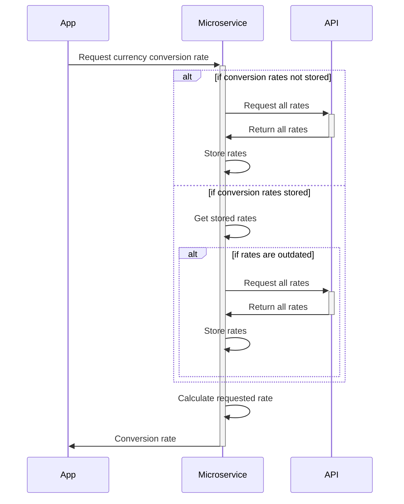

# CS361 Project

## Request and receive data from microservice
```python
# import requests library to request data from microservice
from requests import request

# request data
# upon receiving the data, retrieve the json payload and store in "data" variable 
data = request('GET', 'http://localhost:8000/USD-RUB').json()

# print the data
print(data)
```

`{'result': 'success', 'rate': 92.4172}`

## UML diagram
